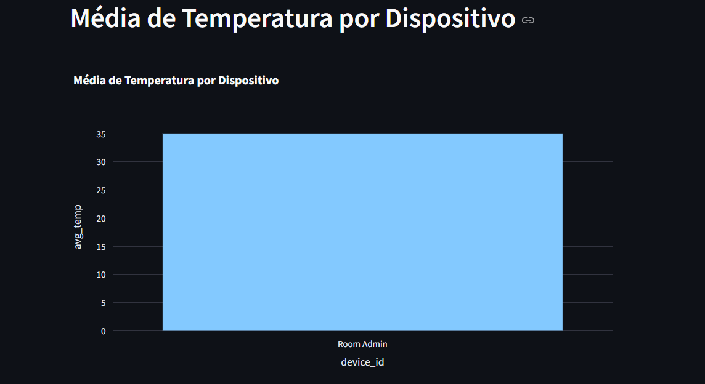
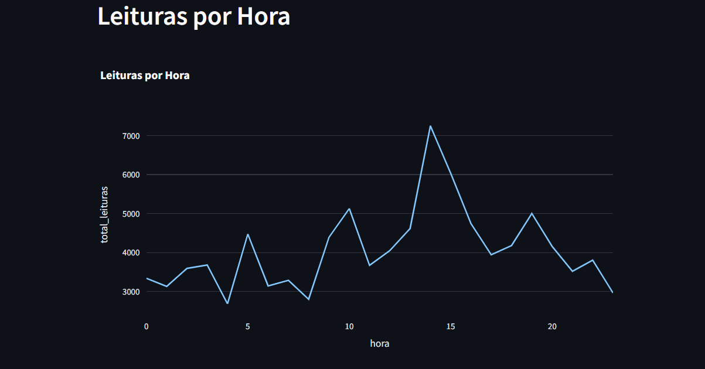
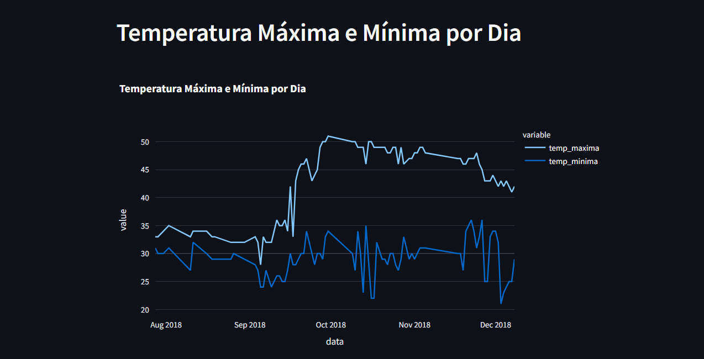

Pipeline de Dados IoT

Introdução
Este projeto apresenta um pipeline de dados que integra dispositivos IoT para leitura de temperaturas, utilizando Docker, DBeaver e Streamlit para criação de um dashboard interativo.

---

 Tecnologias Utilizadas
- Python
- Docker
- DBeaver
- PostgreSQL
- Kaggle
- Streamlit
- Git

---

Passo a Passo da Instalação

1. Clonar o Repositório

git clone https://github.com/VitorDark-tech/-IoT_Data_Pipeline.git
cd -IoT_Data_Pipeline

2. Criar Ambiente Virtual
pip install virtualenv
virtualenv venv
venv\\Scripts\\activate  # Windows

3. Conexão com Banco de Dados DBeaver
Abra o DBeaver.
Vá para Database → New Database Connection.
Escolha PostgreSQL.
Preencha as informações:
Host: localhost
Port: 5432
Database: postgres
User: postgres
Password: sua_senha
Clique em Test Connection para verificar se está tudo certo.

Visualizações:
### Gráfico de Média por Temperatura por Dispositivo

### Gráfico de Leituras por Hora

### Gráfico de Temperatuuras Máximas e Mínimas

Views SQL e Propósitos
1. Média de Temperatura por Dispositivo
CREATE VIEW avg_temp_por_dispositivo AS 
SELECT "room_id/id" AS device_id, AVG(temp) AS avg_temp 
FROM temperature_readings 
GROUP BY device_id;

Propósito: Calcula a média da temperatura por dispositivo.

2. Leituras por Hora
CREATE VIEW leituras_por_hora AS 
SELECT EXTRACT(HOUR FROM TO_TIMESTAMP(noted_date, 'DD-MM-YYYY HH24:MI')) AS hora, 
       COUNT(*) AS total_leituras 
FROM temperature_readings 
GROUP BY hora 
ORDER BY hora;

Propósito: Mostra quantas leituras foram feitas por hora.

3. Temperaturas Máximas e Mínimas por Dia
CREATE VIEW temp_max_min_por_dia AS 
SELECT DATE(TO_TIMESTAMP(noted_date, 'DD-MM-YYYY HH24:MI')) AS data, 
       MAX(temp) AS temp_maxima, 
       MIN(temp) AS temp_minima 
FROM temperature_readings 
GROUP BY data 
ORDER BY data;

Propósito: Mostra a temperatura máxima e mínima por dia.

Insights Obtidos 

Padrões de Temperatura: Identificação dos dispositivos que registram temperaturas mais altas ou mais baixas. 

Horários de Pico: Determinação das horas com maior volume de leituras. 

Variações Diárias: Análise das temperaturas máximas e mínimas para identificar mudanças climáticas ao longo dos dias. 